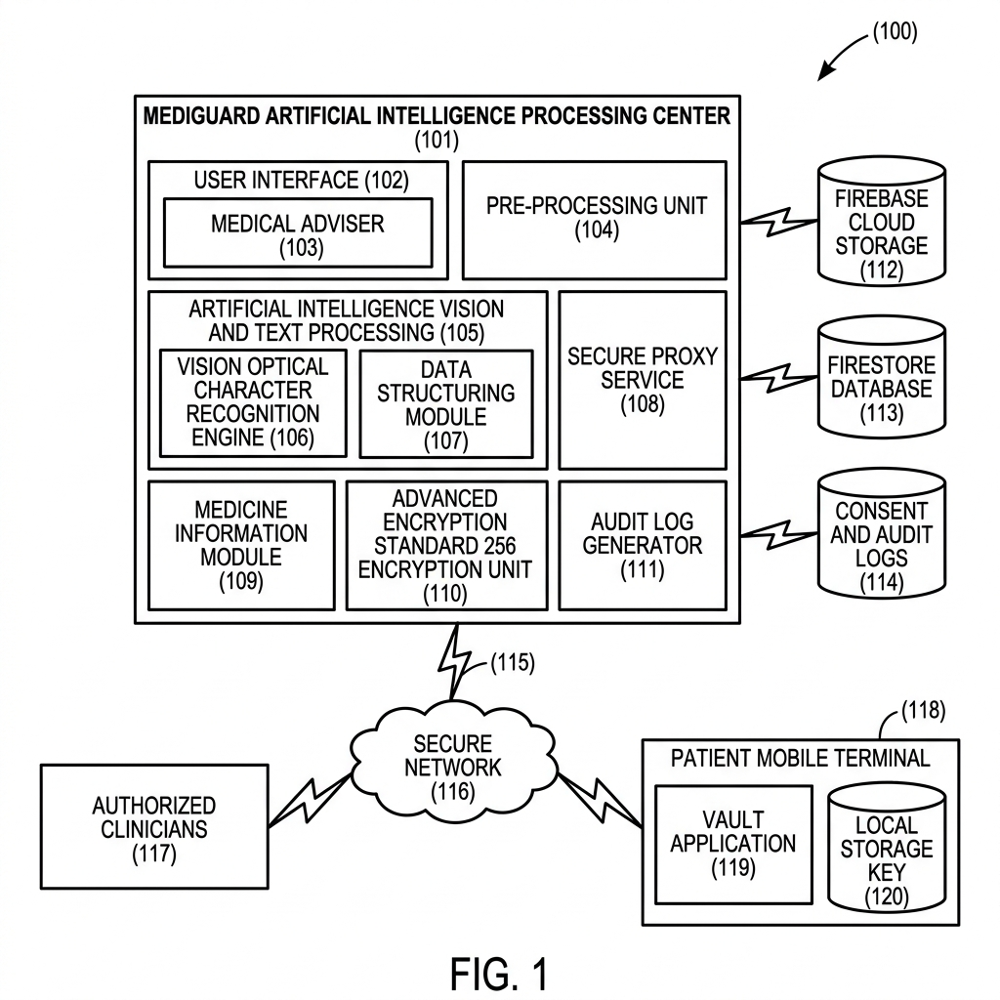
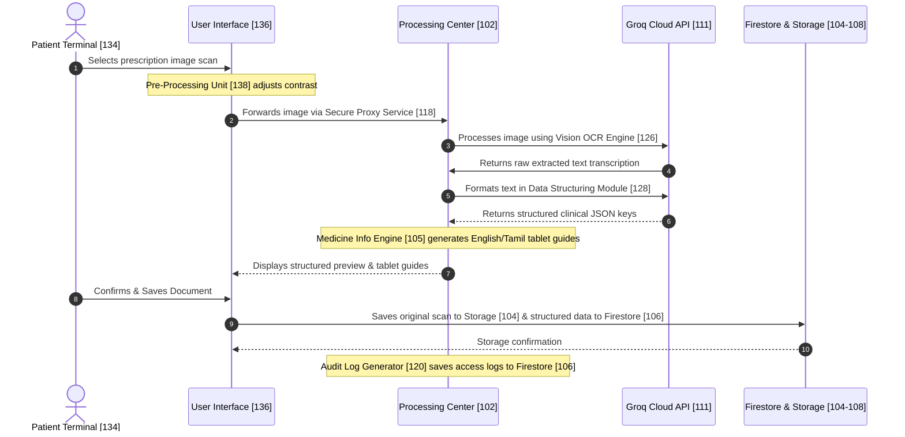

# System Architecture Specification

This document details the system design, data flow, and formal patent-style architecture for the **MediGuard Artificial Intelligence Processing Center** matching our exact implementation details.

---

## 📄 Patent-Style Architectural Block Diagram (Fig. 1)

Below is the formal block diagram of the system, modeled directly after standard patent drawings (clean line art, black-and-white structure, and numeric component references) representing what has been built:

---

## 🔍 System Component Mapping Table

| Ref # | Component Name | Description |
| :--- | :--- | :--- |
| **(100)** | **System Overview** | The complete end-to-end medical scanning, encryption, and audit network. |
| **(102)** | **MediGuard Artificial Intelligence Processing Center** | The core application server executing clinical analysis and Artificial Intelligence pipelines. |
| **(136)** | **User Interface** | Frontend client dashboard managing input, logs, and clinician requests. |
| **(130)** | **Medical Adviser** | Interactive wellness assistant explaining medical reports and findings. |
| **(138)** | **Pre-Processing Unit** | Preprocesses uploaded images (contrast enhancement and resizing) for scanning. |
| **(124)** | **AI Vision & Text Processing** | Coordinates LLM processing to transcribe and analyze uploaded clinical records. |
| **(126)** | **Vision OCR Engine** | Employs the `llama-4-scout` vision model to extract raw handwritten text from images. |
| **(128)** | **Data Structuring Module** | Formats raw text into valid JSON via `llama-3.3-70b-versatile`. |
| **(118)** | **Secure Proxy Service** | Proxies and validates all client requests (Port `3001` backend endpoints). |
| **(132)** | **Medicine Information Module** | Renders patient-friendly bilingual (English & Tamil) information about prescribed tablets. |
| **(122)** | **AES-256 Encryption Unit** | Handles record encryption steps (hashing, encrypting, ledgering simulations). |
| **(120)** | **Audit Log Generator** | Generates system logs for transaction, signature, and user audit trails. |
| **(104)** | **Firebase Cloud Storage** | Encrypted Firebase Cloud Storage hosting raw prescription images. |
| **(106)** | **Firestore Database** | Database storing accounts, metadata, logs, and clinician consent lists. |
| **(108)** | **Consent & Audit Logs** | Collections in Firestore storing consent transaction records and log trails. |
| **(110)** | **Local Drug Synonyms** | Fallback dictionary engine in `server.js` matching equivalent brand/generic drugs. |
| **(114)** | **Connecting Interface** | Cryptographic network link connecting the main center to external networks. |
| **(116)** | **Secure Network** | Encrypted communication routing data between active nodes. |
| **(112)** | **Authorized Clinicians** | Clinicians, hospitals, and pharmacies requesting decryption access. |
| **(134)** | **Patient Mobile Terminal** | Sovereign user terminal where records are managed and uploaded. |
| **(130a)** | **Vault Application** | Local client application running on the patient's personal device. |
| **(104a)** | **Local Storage Key** | Secure local storage database on the patient's personal device. |

---

## 🔄 Interaction Sequence Flow

